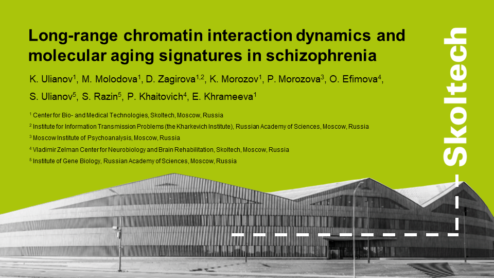
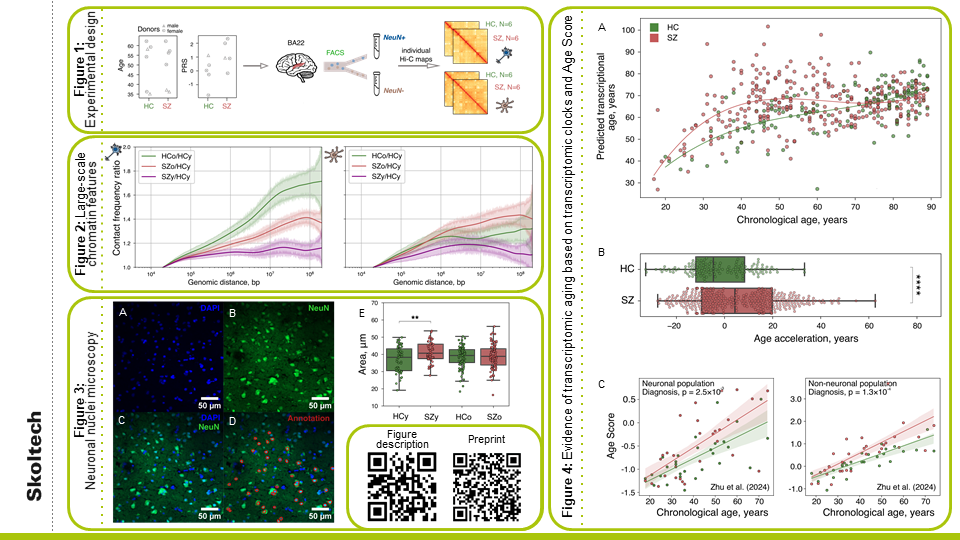

# Long-range chromatin interaction dynamics and molecular aging signatures in schizophrenia
K. Ulianov [1], M. Molodova [1], D. Zagirova [1,2], K. Morozov [1], P. Morozova [3], O. Efimova [4], S. Ulianov [5], S. Razin [5], P. Khaitovich [4], E. Khrameeva [1]  
1) Center for Bio- and Medical Technologies, Skoltech, Moscow, Russia  
2) Institute for Information Transmission Problems (the Kharkevich Institute), Russian Academy of Sciences, Moscow, Russia  
3) Moscow Institute of Psychoanalysis, Moscow, Russia  
4) Vladimir Zelman Center for Neurobiology and Brain Rehabilitation, Skoltech, Moscow, Russia  
5) Institute of Gene Biology, Russian Academy of Sciences, Moscow, Russia  
## Conference Poster
### Slide 1

### Slide 2

### PDF version
[Download poster](poster.pdf)
## Figure descriptions
### Figure 1. Experimental design.
**A-B.** Characteristics of diagnostic cohorts: age and sex (A), polygenic risk score (B).  
**C.** Anatomical localization of the analyzed brain region, experimental procedure and the design of this study.  
### Figure 2. Large-scale chromatin features in SZ and HC.
Average polymer scaling ratios calculated for HCo/HCy (green), SZy/HCy (purple) and SZo/HCy (red) in neurons (left) and non-neurons (right).  
### Figure 3. Analysis of brain tissue microscopy and nuclei sizes.
**A-C.** Nuclei staining for double-stranded DNA with DAPI and with antibodies against the neuronal marker NeuN.  
**D.** A semi-automated segmentation pipeline was applied to select only neuronal nuclei (red contour).  
**E.** Comparison of nuclear area between age groups and diagnostic cohorts. Asterisk indicates Mann-Whitney U test p-value: ** - p-value < 0.01.
### Figure 4. Analysis of transcriptional age acceleration.
**A.** Elastic Net-based prediction of transcriptional age over chronological age.  
**B.** Aging acceleration in bulk tissue according to PsychENCODE data. Asterisks indicate Mann-Whitney U test p-value: **** - p-value < 0.0001.  
**C.** The Age Score was constructed based on three publicly available dataset in both neuronal and non-neuronal cells. The fixed effect of diagnosis was calculated using ANOVA, Diagnosis factor.  
## Citation
Ulianov KA, Zagirova DR, Kononkova AD, Dudkovskaia AV, Molodova MN, Morozov KV, et al. Accelerated Aging Signatures in 3D Genome Organization and Transcriptome in Schizophrenia [Internet]. bioRxiv; 2026. p. 2026.05.25.727571. Available from: https://www.biorxiv.org/content/10.64898/2026.05.25.727571v1 doi:10.64898/2026.05.25.727571
## Contact
Email: kirill.ulianov.correspondence@gmail.com
